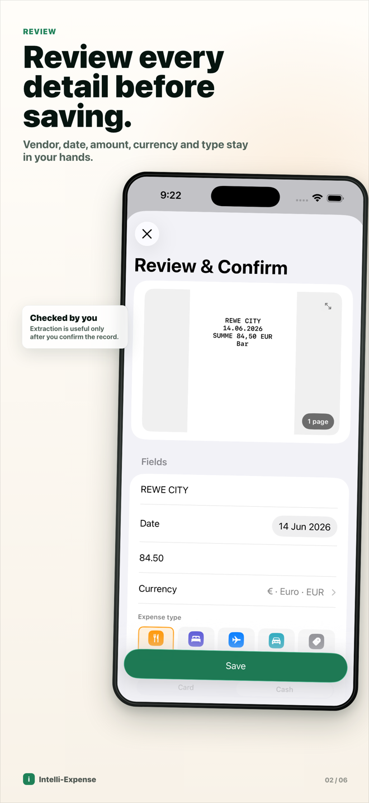
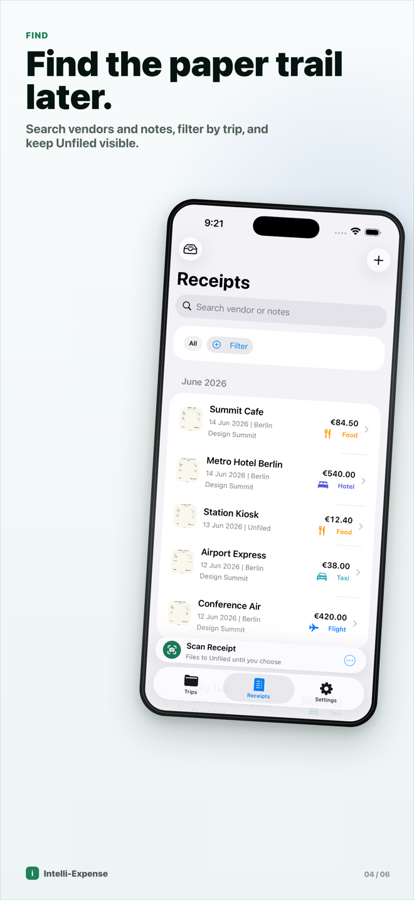
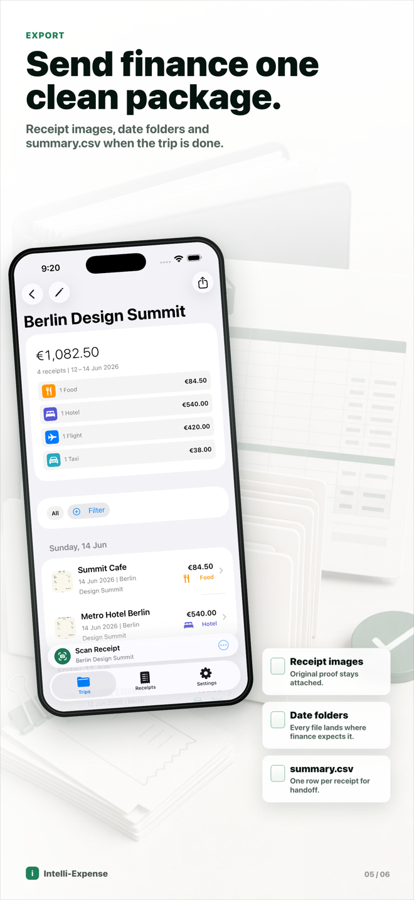
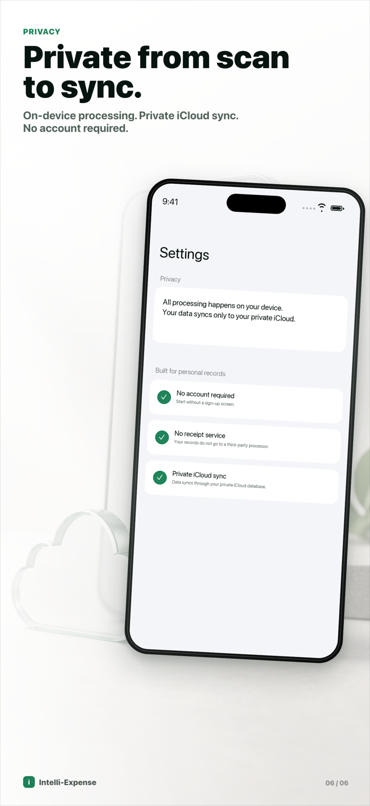

# Intelli-Expense

**Private, on-device receipt scanning for iPhone and Mac.** Point the camera at a paper receipt; on-device Apple Intelligence extracts the vendor, date, total, currency, and category; you confirm with one glance; the receipt lands in an organized folder you can export as a finance-ready zip. No servers, no accounts, no analytics — the app makes **zero network calls** except syncing to your own private iCloud.

> Coming to the App Store as a **free app** — no in-app purchases, no ads, no sign-up.

| Review | Find receipts |
|---|---|
|  |  |

| Export | Privacy |
|---|---|
|  |  |

## Why this exists

This started as a personal pain point: traveling for work, paying with a personal card, and ending every trip with a pocket full of paper receipts and a camera roll full of unfindable photos. The fix had to work anywhere, instantly, offline — scan a receipt at an airport gate, confirm the extracted fields in seconds, done. Since then it has grown beyond work trips: **profiles** seed folders for conferences, client visits, medical claims, home projects, vehicle costs, warranties, events, and more, each with its own editable category set.

And because we're in the era of enthusiasts working alongside AI agents, it grew a second front door: an **agent import bridge**, so a coding agent on your Mac can file receipts for you — conversationally, structured, and always with your explicit confirmation — while your receipts stay as unorganized files on disk.

## The on-device AI pipeline

Every receipt goes through a pipeline that runs entirely on the device:

```
Capture (camera / photos / file / PDF)
  → Vision document OCR (RecognizeDocumentsRequest)
  → deterministic parser (dates, amounts, currencies, keywords)
  → Foundation Models guided generation (@Generable / @Guide schema)
  → merge & confidence
  → review-first confirmation UI
```

Design decisions worth stealing:

- **Deterministic parse is baseline truth.** The language model refines and disambiguates; it never silently overrides what the parser found.
- **Guided generation, not free text.** A `@Generable` schema with `@Guide` constraints (and `anyOf` enums) means the model can't return malformed data. Greedy sampling, a hard 30-second timeout, and context-size budgeting (evidence is iteratively shrunk to fit the model's context window) keep it predictable.
- **Uncertainty becomes UX.** When the model is unsure, the schema carries an alternate value plus a reason, and the review screen presents a two-option choice instead of a silent guess.
- **Graceful degradation.** Model availability states (Apple Intelligence off, model downloading, ineligible hardware) are first-class; capture and manual entry always work.

The main implementation is in [`FoundationModelReceiptService.swift`](IntelliExpense/Capture/FoundationModelReceiptService.swift).

## The agent import bridge

The native Mac companion app publishes a read-only `manifest.json` (your folders, their categories, currencies) and watches an app-owned inbox folder. A local AI agent — Claude Code and Codex skills ship in [`plugin/`](plugin/) — can then file receipts conversationally:

1. You point the agent at a messy folder of receipt images and PDFs.
2. The agent reads the manifest, extracts the fields itself, and **confirms every field with you in the conversation**.
3. It copies the file plus a JSON sidecar into the inbox — structured drops skip OCR and the model entirely; raw drops go through the normal pipeline.
4. The app validates, persists, and syncs. Results land in `processed/` or `failed/` with machine-readable reasons.

The trust boundary is strict: **agents never touch the database.** The app is the sole writer to its SwiftData store and CloudKit sync; agents only copy files into a folder, and every agent-entered receipt carries visible provenance ("Entered by agent") with the verbatim sidecar preserved. See the [protocol documentation](plugin/README.md).

## Features

| Area | What you get |
|---|---|
| Capture | Camera document scan (multi-page), photo library, file/PDF import, manual entry, share extension, Quick Capture widget & Control Center/Action Button control |
| Organize | Folders with profiles (work trip, conference, medical claim, …), editable per-folder categories, pinning, archiving, duplicate detection |
| Totals | Per-receipt currency, per-folder totals by currency and category — no conversion guesswork |
| Export | Per-folder zip: date-named receipt images + RFC-4180 `summary.csv` |
| Mac app | Native `NavigationSplitView` companion: drag-drop and file-first import, Continuity Camera, review, undo/redo, agent bridge |
| Sync | Your private iCloud database (CloudKit), end to end — no third-party backend |
| Languages | English UI, localization-ready architecture; receipts extract in any Apple Intelligence-supported language |

## Requirements

- **iOS 26 / macOS 26** or later.
- AI extraction requires Apple Intelligence-capable hardware. Simulator and unsupported-runtime states remain explicit and testable; the shipping app does not pretend that a permanently ineligible device can provide smart extraction.
- Building: Xcode 26+, [xcodegen](https://github.com/yonaskolb/XcodeGen) (`project.yml` is the project source of truth). An isolated Xcode 27-beta lane exists behind the `XCODE_27_FOUNDATION_MODELS` flag for the image-input path.

## Building and testing

```sh
make gen           # regenerate the Xcode project from project.yml
make build-mac     # build the native Mac app; unsigned when TEAM_ID is unset
make help          # all targets
make test-core     # ExpenseCore Swift package tests (pure logic: parser, export, merge policy)
make test-app      # iOS app unit + UI tests on the simulator
make test          # the full automated gate
```

Simulator builds and tests do not need an Apple Developer account. For a personal-device build, copy `Makefile.local.example` to `Makefile.local` and add your own team and device identifier; Xcode uses automatic signing by default. If you manage profiles manually, set `DEVELOPMENT_CODE_SIGN_STYLE := Manual` and supply your signing identity plus development profile names for the app and its two extensions. The local file is ignored by git, and the public project intentionally contains no developer-team, certificate, device, provisioning-profile, or App Store Connect identifiers.

The supported public path is a simulator or personal-device build with your own signing. App Store distribution, the maintainer's private CloudKit production container, and release operations are not part of the contributor build contract.

## How it was built

This repo is also a worked example of docs-first, agent-assisted development: a binding [PRD](PRD.md) and [design system](DESIGN.md), per-feature specs in [`docs/specs/`](docs/specs/), and [agent ground rules](AGENTS.md) — with coding agents (Claude Code, Codex) doing implementation under human review. If that workflow interests you, the docs are the interesting part.

## License

[MIT](LICENSE)
