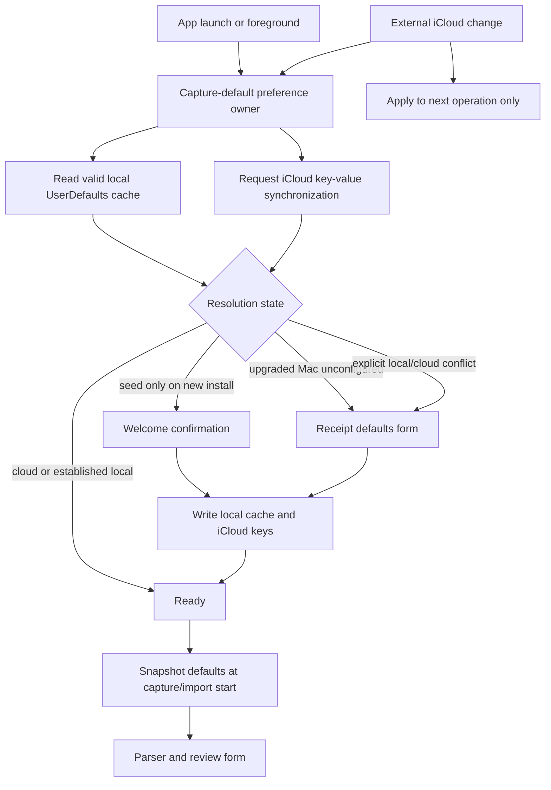

# SPEC — Cross-device capture defaults and Mac setup reconciliation

**Status:** proposed — root cause confirmed; implementation not started
**Owner screens/files:** shared app startup (`IntelliExpense/IntelliExpenseApp.swift`), iPhone root (`IntelliExpense/ContentView.swift`), Mac root and import pipeline entry (`IntelliExpense/Mac/MacContentView.swift`), onboarding (`IntelliExpense/UI/OnboardingViews.swift`), Settings and currency catalog (`IntelliExpense/UI/SettingsView.swift`), shared app services (`IntelliExpense/App/AppServices.swift`), iPhone/Mac entitlements (`IntelliExpense/IntelliExpense.entitlements`, `IntelliExpense/IntelliExpenseMac.entitlements`), generated-project source (`project.yml`)
**Existing specs extended:** `docs/specs/SPEC-default-currency-detection.md` (seed-once and picker contract), `docs/specs/SPEC-mac-app.md` (same-product and private-iCloud contract), `docs/specs/SPEC-mac-folder-editor-modal-adaptation.md` (Mac form/page presentation roles)
**Docs this spec amends:** `PRD.md` §5.0 and §5.3 (device-local onboarding versus account-wide capture defaults), `DESIGN.md` §10 (preference ownership and Mac catalog-sheet sizing), `design/ui-spec.html` onboarding/Settings/Mac sections, `ASC.md` (iCloud key-value capability and profile verification)

---

## 1. Problem and confirmed root cause

The Mac app imported an Indian receipt whose printed total has no explicit currency symbol or ISO code. The review form showed **USD**, even though the Mac region is India and the iPhone app is configured for INR. Opening the Mac currency picker then produced a title and Cancel button with no visible search field or currency rows.

These are three defects with two causal chains, plus one missing product contract.

### 1.1 Why the Mac default is USD

The currency feature landed in commit `6b6a76c` before the native Mac target landed in `54f59be`.

- `IntelliExpense/ContentView.swift` seeds `DefaultCurrencySettings` in the iPhone root initializer.
- `IntelliExpense/IntelliExpenseApp.swift` creates `MacContentView` directly on macOS.
- `IntelliExpense/Mac/MacContentView.swift` has no equivalent currency bootstrap before `MacLibraryView` reads `@AppStorage`.
- `IntelliExpense/UI/SettingsView.swift` declares the `@AppStorage` fallback as the literal `USD`.

Live evidence from the affected Mac removes locale detection as a hypothesis:

- `Locale.current.identifier` is `en_IN`.
- `Locale.current.currency` is `INR`.
- Foundation returns 308 ISO currency entries.
- `UserDefaults` contains `hasSeenWelcome = true`, but contains neither `defaultCurrencyCode` nor `defaultCurrencyCodeSeededFromLocale`.

The Mac therefore never runs locale detection. Both Settings and import read the `@AppStorage` fallback value, which is USD.

### 1.2 Why the imported receipt inherits USD

The raw Mac import path in `MacLibraryView` passes its current `defaultCurrencyCode` into `ReceiptFileIngestionProcessor` and the shared processing pipeline. `ReceiptAmountParser` assigns the configured default currency whenever an amount has no printed currency code or recognized symbol. The synthetic Kaveri Fresh Mart receipt contains the amount `1864.30` without a currency marker, so the parser correctly follows its contract and associates the Mac default—currently the erroneous USD—with the amount. The review form is displaying upstream state; it is not independently changing INR to USD.

Changing the review screen to guess INR from the merchant address would patch the symptom and violate the existing deterministic-default contract. The invalid state originates before extraction begins.

### 1.3 Why the picker looks empty

`CurrencyCatalog.allOptions()` is populated on this Mac, but `CurrencyPickerRow` presents a flexible `List` in a macOS sheet without a semantic presentation role or a bounded content viewport. The sheet adopts the intrinsic size of its navigation/toolbar chrome, leaving effectively no height for the list. This is the same already-documented failure mode that collapsed Browse Categories before `macCatalogPresentation` was added: a flexible Mac `List` cannot establish a useful sheet height by itself.

The currency data is not empty. The catalog presentation is collapsed.

### 1.4 Why the Mac does not automatically use the phone setting

`defaultCurrencyCode` and `defaultPaymentMethod` are stored through SwiftUI `@AppStorage`, which reflects `UserDefaults`. Apple explicitly documents that defaults are device-specific and must not be used to share values between a person’s devices. The app’s SwiftData/CloudKit container syncs receipts, folders, drafts, and attachments; it does not mirror `UserDefaults`.

The Settings iCloud status currently implies broader product continuity than the implementation provides: receipt data syncs, but receipt-capture defaults do not.

### 1.5 Why existing tests missed it

- `IntelliExpenseTests/PersistenceTests.swift` proves locale seeding when `DefaultCurrencySettings.seedIfNeeded` is called; it does not prove every platform root calls it.
- iPhone UI tests cover onboarding and the picker, but the Mac UI suite has no Settings/currency flow.
- The Mac target was added after the currency spec and reused shared views without a cross-platform startup contract.
- Build success proves the APIs compile on macOS; it does not prove that a sheet has a usable body viewport.
- No test distinguishes device-local `UserDefaults` from the account-wide behavior implied by “same product” and iCloud sync.

No matching open or closed GitHub issue or pull request was found for Mac currency defaults or the currency picker.

---

## 2. Goals

- A raw/manual receipt started on iPhone or Mac uses the same account-wide default currency and default payment method once iCloud has synchronized.
- A fresh install on either platform has a valid default before capture/import begins, preferring an existing iCloud value and otherwise using the device locale for currency and Card for payment.
- New Mac installs use the existing shared welcome screen; upgraded Macs that previously skipped currency initialization receive a compact one-time reconciliation, not a replay of product onboarding.
- Existing explicit choices are never silently replaced by a locale seed.
- The Mac currency picker always opens as a usable searchable catalog with visible rows on the first frame.
- Capture remains available offline and when iCloud is unavailable; the last valid local value remains usable.
- The preference lifecycle is deterministic and testable with local and ubiquitous-store fakes, including initial sync, external changes, account changes, conflicts, invalid values, and delayed propagation.
- iPhone and Mac use one domain owner for capture defaults rather than scattered `@AppStorage` reads and platform-specific startup calls.

## 3. Non-goals

- No currency conversion, exchange-rate lookup, location lookup, StoreKit storefront inference, or merchant-address geocoding.
- No change to extraction precedence: a printed/accepted extracted currency still wins; the default is used only where the receipt supplies none.
- No syncing of `hasSeenWelcome`, Mac content zoom, scene/sidebar selection, pending modal state, UI-test flags, or other device/window state.
- No syncing of `Agent entries require in-app review`; it controls the Mac-owned bridge and remains Mac-local.
- No SwiftData/CloudKit schema entity for preferences. Small account-wide settings use Apple’s purpose-built iCloud key-value store instead of introducing duplicate singleton-record and migration problems into the receipt database.
- No full onboarding replay for existing users and no new multi-page setup flow.
- No redesign of the currency catalog rows or Settings window beyond the sizing, state, and sync affordances defined here.
- No attempt to make iCloud propagation immediate; Apple documents iCloud key-value synchronization as eventual.

---

## 4. Design decisions

### D1 — Treat capture defaults as account-wide product preferences

The following settings describe how a receipt begins and therefore sync across iPhone and Mac:

| Preference | Account-wide representation | Local cache | Validation |
|---|---|---|---|
| Default currency | ISO 4217 code | existing `defaultCurrencyCode` key | `CurrencyCatalog.normalizedISOCode` |
| Default payment method | existing `PaymentMethod` raw value | existing `defaultPaymentMethod` key | exact known enum value |

All capture and import entry points read these values from one shared preference owner. Views bind to that owner; they do not each invent fallback behavior through independent `@AppStorage` declarations.

The owner keeps a local `UserDefaults` cache for instant, offline startup and mirrors the two values through `NSUbiquitousKeyValueStore`. The local keys remain stable so upgrades preserve current preferences and existing test/reset lanes can migrate deliberately.

Payment is included with currency because both rows define the same capture snapshot and already flow together through every manual/raw entry point. Once the entitlement, migration state, conflict handling, setup form, and two-device proof exist for currency, leaving payment device-local would preserve an unexplained cross-platform split and require a second migration later for little saved complexity.

`hasSeenWelcome` remains device-local. A new Mac should still introduce the Mac app even if the iPhone welcome was completed, while its currency/payment rows may already be populated from iCloud.

Rationale: Apple’s `UserDefaults` documentation says defaults are stored locally and should not be used for cross-device sharing; it directs apps to `NSUbiquitousKeyValueStore` for small settings shared among a person’s devices. This is exactly the capture-default use case.

Considered and rejected: a singleton SwiftData `AppPreference` model. CloudKit-safe models cannot use a uniqueness constraint, and independent first launches can create duplicate singleton rows requiring custom convergence. It also couples two simple preferences to the financial data schema and migration path.

### D2 — One observable preference owner controls bootstrap, cache, and sync

A shared app-level preference owner is created before either platform root begins capture work and injected into onboarding, Settings, iPhone capture, Mac import, raw agent import, manual entry, and pipeline construction.

Its responsibilities are deliberately narrow:

1. Validate and expose the current currency/payment values.
2. Hydrate immediately from valid local cache values.
3. Register for iCloud key-value external-change notifications shortly after launch.
4. Request iCloud synchronization at launch and when returning to the foreground, without polling or assuming immediate delivery.
5. Apply valid remote changes to the local cache and live bindings.
6. Persist user edits to both stores.
7. Report whether the values are ready, locally defaulted, awaiting initial iCloud state, cloud-backed, conflicting, or unavailable for the one-time setup UI and deterministic tests.

The preference owner is not part of SwiftData and does not depend on a model context. It is injectable behind small local/ubiquitous store boundaries so tests never require an Apple account or live iCloud.

The existing `DefaultCurrencySettings` and `CurrencyCatalog` behavior moves out of `SettingsView.swift` into this shared domain surface. `SettingsView` remains a consumer, not the owner of launch-time app state.

### D3 — Bootstrap precedence prevents USD fallback from becoming data

Each preference resolves an immediate usable local value in this order:

1. A valid iCloud key-value store value already present in the local ubiquitous-store cache.
2. A valid established local value from an existing install.
3. A platform-neutral seed: `Locale.current.currency` for currency, Card for payment.
4. USD only when Foundation provides no valid locale currency.

The literal fallback exists only inside the resolver. UI property wrappers and import code never independently default to USD.

This is startup availability order, not proof that a missing ubiquitous key is globally absent. Until iCloud reports initial state, “no cloud value” is indeterminate and cannot authorize an automatic upload that might overwrite a value not delivered yet. D4 owns convergence once initial state or an explicit user decision exists.

An unconfigured device may use its local seed while offline, but that state is marked as a seed rather than an explicit user choice. A later valid cloud value may replace a seed. A value explicitly chosen in onboarding, Settings, or reconciliation is marked locally as user-owned and is never silently replaced by a late-arriving conflicting value.

This distinction closes the current failure: the affected Mac has no established currency key, so it resolves to INR from `en_IN` rather than exposing USD.

### D4 — Define migration and conflict behavior explicitly

Existing installations predate ubiquitous preference metadata, so migration must not pretend it can always infer which device was edited most recently.

- **Initial iCloud state not yet delivered:** treat a missing ubiquitous key as unknown, not absent. Register for external changes before requesting synchronization. Do not auto-publish a legacy value or seed solely because the first local read is nil.
- **Cloud value exists, local value absent or only locale-seeded:** adopt cloud and cache it locally.
- **Initial sync is known and the cloud key is absent, valid established local value exists:** publish the established local value and mark migration complete.
- **Initial sync is known and both stores are absent:** use D3’s locale/default seed. Currency publishes after the person confirms it through onboarding or the compact setup surface; Card may remain a local reasonable default until the first explicit edit or the same setup confirmation.
- **Initial sync cannot complete because the device is offline or signed out:** continue with a valid local value. An explicit onboarding/Settings/setup choice may be queued for later publication because it is a current user decision; an unconfirmed seed must not overwrite a future cloud value.
- **Cloud and an explicit local value differ:** do not silently choose. Present the compact reconciliation surface with both human-readable values; the person’s choice becomes the new account-wide value.
- **Two legacy devices publish different established values before either receives the other:** the first external difference observed becomes the same explicit reconciliation case. The implementation must not claim that the phone can be read directly from the Mac before iCloud has propagated it.
- **Invalid remote value:** ignore it, retain the valid local value, and publish a repaired value only after user confirmation or an explicit edit.
- **Apple account changes:** retain the last valid local values for offline use but mark their cloud provenance unresolved. Never upload the prior account’s cached values into the new account until the new account’s initial state arrives or the person explicitly confirms those values for the new account.

For normal post-migration edits, Apple’s key-value store remains the replication/conflict mechanism. Currency and payment use separate keys so independent edits do not overwrite an unrelated stale field.

No “last updated on device X” UI is introduced; device names and timestamps do not improve the decision enough to justify more metadata or copy.

### D5 — Keep onboarding local, but make its defaults cloud-aware

New iPhone and Mac installs continue to show the shared `OnboardingWelcomeView` because `hasSeenWelcome` remains local. Its currency row binds to the shared preference owner:

- Show a valid cached/cloud value immediately when available.
- Otherwise show the locale seed.
- If iCloud supplies a value before Continue and the person has not edited the row, update the row.
- Changing the value in onboarding is an explicit user choice and publishes it account-wide.
- Continue records confirmation of the shown currency as well as completion of the local welcome screen.

The welcome screen does not gain a payment row. Payment uses the cloud-backed value when available and otherwise the reasonable Card default; it remains editable in Settings. A real explicit payment conflict is handled by D6’s compact reconciliation rather than adding routine first-run friction.

No new onboarding screen is added. Apple’s HIG says onboarding should be brief and optional and that apps should provide reasonable defaults instead of front-loading nonessential customization. The existing one-row confirmation remains the right first-run shape.

### D6 — Existing unconfigured Macs get compact setup, not repeated onboarding

An existing Mac may have `hasSeenWelcome = true` but no valid capture-default state—the exact state confirmed in this incident. Replaying the welcome/product explanation would be confusing and would violate the local meaning of “welcome seen.”

Instead, after the library window becomes active, show one compact system form only when:

- onboarding is already complete on this Mac; and
- currency is unresolved/unconfirmed, or either preference is in a real migration conflict.

The form is titled **Receipt defaults** and contains only Default currency, Default payment, one short explanation, and Continue. Currency opens the shared picker. If local and iCloud values conflict, the rows explain which candidate is currently on this Mac and which came from iCloud; selecting either and continuing resolves the account-wide value.

The form does not block browsing synced receipts, Settings, or export. Raw import, manual entry, and raw agent drops must resolve the form first because those actions can persist a default-derived currency/payment. Structured agent records carry an explicit validated currency/payment and do not depend on these defaults.

Once confirmed, the form never appears again unless a future unresolved explicit conflict is received. A normal external update applies silently and updates Settings because it represents the account-wide preference the person already established.

Editing the affected row in Settings is also an explicit resolution. If Settings produces valid confirmed values, any pending setup surface dismisses and the same values publish through the shared preference owner.

Rules satisfied: `DESIGN.md` §10 says Mac is the same product and shared behavior stays shared; the HIG says postpone nonessential setup, so this surface is limited to the two values required for financially correct capture.

### D7 — Make the currency picker a semantic Mac catalog sheet

The shared `CurrencyPickerView` keeps its current data, search, suggested section, row anatomy, identifiers, localization, and one-tap selection behavior.

On macOS, its presented root adopts the existing catalog/page presentation seam from `IntelliExpense/UI/PlatformPresentationSupport.swift`:

- use the system page presentation role;
- provide a bounded, scrollable viewport on the first frame;
- remain usable at the app’s minimum window size and at larger accessibility text sizes;
- preserve system sheet chrome, focus rings, resizing, default/cancel behavior, and materials;
- never rely on the flexible `List` to supply intrinsic sheet height.

On iPhone, presentation remains unchanged.

Apple’s `View.presentationSizing(_:)` documentation says the sizing proposes dimensions to presented content, and `PresentationSizing.page` is available on macOS 15.0+ for page-like informational/compositional content. The project already uses this exact semantic role for searchable category catalogs.

Considered and rejected: hardcoding one 500×600 rectangle on both platforms. It would fork phone presentation, clip localization/accessibility growth, and duplicate the defect class already addressed by the platform-presentation seam.

### D8 — Make preference ownership visible in Settings

The Defaults section remains visually minimal. Currency and payment rows retain their current controls, but a quiet localized footnote states that receipt defaults sync through the person’s iCloud account when available and remain usable offline.

The iCloud status section continues to report account availability. It must not imply real-time synchronization: Apple documents that ubiquitous key-value updates are eventual and can be limited to several deliveries per minute.

Mac-only Agent entries settings remain in their own section and local. This visual separation reflects the ownership boundary instead of making every Settings value appear account-wide.

### D9 — Add and verify the iCloud key-value entitlement on both app targets

Both durable app targets enable iCloud Key-Value Storage with the same team/bundle-derived store identifier. `project.yml` remains the generated-project source of truth; both entitlements files and generated settings must agree.

The implementation updates App Store Connect/provisioning documentation and verifies that development, Mac development, and App Store profiles carry the key-value capability before claiming device sync. Sandbox builds remain deterministic and local-only; they do not read or write the durable app’s ubiquitous preferences.

Only the ISO currency code and payment-method raw value enter the ubiquitous store. Apple documents the key-value store as unencrypted on disk, so receipt contents, merchant data, account/device identifiers, diagnostics, or other personal data must never be added to this preference channel.

Apple documents that `NSUbiquitousKeyValueStore` requires the iCloud Key-Value Store entitlement and App Store/Mac App Store distribution. A local test fake proves behavior; signed development builds prove entitlement wiring only. Cross-device service behavior must be proven with store-distributed/TestFlight builds when development builds do not receive the production key-value service.

### D10 — Keep capture reads coherent during live external updates

An import/capture operation snapshots currency and payment together when the operation starts. A later iCloud update changes the defaults for the next operation but does not mutate an in-progress parser, review form, or already-saved receipt.

The review form remains editable, and extracted explicit currency still wins. This prevents a delayed iCloud notification from changing the meaning of a receipt halfway through processing.

### D11 — Documentation changes land with implementation

- `PRD.md` §5.0 distinguishes local welcome completion from cloud-aware capture-default confirmation; §5.3 states that currency/payment sync while platform/window preferences remain local.
- `DESIGN.md` §10 gains the preference ownership rule and names currency picker as a catalog/page sheet on Mac.
- `design/ui-spec.html` shows the compact upgraded-Mac Receipt defaults form and adds currency picker/Settings ownership annotations.
- `ASC.md` records iCloud Key-Value Storage capability/profile verification for both durable app targets.
- `docs/specs/SPEC-default-currency-detection.md` receives a short cross-reference noting that this follow-up owns Mac startup and cross-device convergence; its locale-detection and picker-content rules remain authoritative.

---

## 5. High-level state and data flow

Preference states used by the UI and tests:

| State | Meaning | Capture behavior |
|---|---|---|
| Ready local | Valid local cache; iCloud unavailable or not yet delivered | Allowed; observe for later cloud change |
| Ready cloud-backed | Local cache matches valid cloud value | Allowed |
| Awaiting initial sync | Ubiquitous key is missing locally, but iCloud has not reported initial state | Do not infer global absence or auto-publish an unconfirmed seed |
| Seed awaiting confirmation | No established value; locale/Card defaults shown | New install confirms currency in onboarding; upgraded Mac confirms both in compact form |
| Conflict | Explicit local value differs from delivered cloud value | Browse/export allowed; default-dependent capture waits for reconciliation |
| Invalid remote | Cloud value fails domain validation | Ignore remote; retain valid local; surface setup only if no valid local exists |

---

## 6. Implementation ownership and sequencing

### U1 — Shared preference domain and deterministic migration

**Files:** create a focused shared preference owner under `IntelliExpense/App/`; move the reusable default/currency domain out of `IntelliExpense/UI/SettingsView.swift`; update `IntelliExpense/App/AppServices.swift`; add iPhone tests in `IntelliExpenseTests/PersistenceTests.swift` or a focused successor and Mac tests in `IntelliExpenseMacTests/`.

**Approach:** characterize the existing key behavior first, then introduce injectable local and ubiquitous stores. Implement D3/D4 resolution, validation, state reporting, external-change handling, and per-operation snapshots without changing parser precedence.

**Required scenarios:** India locale seed; locale without ISO currency; valid local legacy value; invalid legacy value; valid remote value; missing remote key before initial sync; confirmed-absent remote key after initial sync; remote arriving after a seed; remote arriving after an explicit edit; explicit conflict; invalid remote; no iCloud account; account change without prior-account upload; independent currency/payment updates; in-progress capture snapshot stability.

### U2 — Common startup, onboarding, and Mac reconciliation

**Files:** `IntelliExpense/IntelliExpenseApp.swift`, `IntelliExpense/ContentView.swift`, `IntelliExpense/Mac/MacContentView.swift`, `IntelliExpense/UI/OnboardingViews.swift`, new/reused shared setup view under `IntelliExpense/UI/`, app launch configuration and seed helpers as required.

**Approach:** instantiate the preference owner once for each process and inject it into both platform trees. New installs confirm in the existing welcome row. Existing unconfigured Macs use D6’s compact form. Sandbox/UI tests receive deterministic fake states and never touch the durable cloud store.

**Required scenarios:** fresh iPhone; fresh Mac; existing configured iPhone; existing configured Mac; exact incident state (`hasSeenWelcome = true`, no currency/seed key, India locale); conflict while library is open; structured agent import bypass; raw import gate; cancel/relaunch; offline confirmation followed by later sync.

### U3 — Settings bindings and Mac picker presentation

**Files:** `IntelliExpense/UI/SettingsView.swift`, `IntelliExpense/UI/PlatformPresentationSupport.swift`, `IntelliExpense/Resources/Localizable.xcstrings`, `IntelliExpenseUITests/IntelliExpenseUITests.swift`, `IntelliExpenseMacUITests/IntelliExpenseMacUITests.swift`.

**Approach:** bind both default rows to the shared owner, add the sync footnote, and apply the catalog/page presentation seam to the currency picker on Mac only. Preserve all existing currency row identifiers and add only the reconciliation identifiers from §8.

**Required scenarios:** picker has a positive usable Mac viewport and visible first currency row without window resizing; search INR/Rupee; select INR and observe Settings update; external change updates the row; large text/long localized names scroll; iPhone picker remains unchanged.

### U4 — Entitlements and signed integration proof

**Files:** `project.yml`, `IntelliExpense/IntelliExpense.entitlements`, `IntelliExpense/IntelliExpenseMac.entitlements`, generated project, signing/profile documentation, `ASC.md`.

**Approach:** add the same iCloud key-value store capability to iPhone and Mac durable targets and verify it in signed build products/profiles. Keep sandbox isolated.

**Required scenarios:** local fake-based unit tests do not depend on entitlement; signed iPhone and Mac products contain the expected key-value entitlement; store-distributed/TestFlight iPhone and Mac builds use the same key-value store identifier; iPhone edit reaches Mac and Mac edit reaches iPhone under the same Apple account; offline edit remains local and converges after account/network recovery.

### U5 — Pipeline regression and canonical documentation

**Files:** `ExpenseCore/Tests/ExpenseCoreTests/ReceiptParserTests.swift`, app capture/import tests, `PRD.md`, `DESIGN.md`, `design/ui-spec.html`, `docs/specs/SPEC-default-currency-detection.md`.

**Approach:** add a regression around the synthetic Kaveri Fresh Mart fixture showing that an unmarked `1864.30` amount uses the operation snapshot (INR in the corrected path), while an explicit printed currency still overrides it. Update canonical docs in the same implementation change.

**Required scenarios:** supplied receipt with INR default; same text with a different deliberate default; explicit currency symbol/code override; no mid-processing mutation after an external setting update; docs/spec/mockups agree with the shipped state.

---

## 7. Edge cases and failure behavior

- **iCloud signed out:** use confirmed local values; Settings reports iCloud unavailable; edits remain local and are offered to the store when an account returns.
- **Initial iCloud delivery is slow:** launch and browsing are immediate. A new install shows the local seed; a default-dependent capture requires confirmation, not an indefinite spinner.
- **External change during onboarding:** update an untouched seed row; preserve a row the person already edited and reconcile if values differ.
- **External change during import:** the in-flight snapshot remains fixed; the next import uses the new value.
- **Existing valid INR on phone, empty Mac:** remote INR wins when available; otherwise India-locale INR is confirmed locally. USD must not appear merely because no key exists.
- **Existing valid values differ on both platforms:** do not silently flip either explicit choice; show the reconciliation state when the difference is delivered.
- **Malformed currency/payment in iCloud:** reject it at the boundary and never pass it into parser/review.
- **Unsupported/legacy ISO token:** preserve for diagnostic/migration display only; the person must select a valid catalog option before default-dependent capture.
- **iCloud account switch:** re-evaluate cloud-backed values. Keep valid local explicit values until the new account produces a value; reconcile differences instead of leaking the prior account’s cloud value into the new account automatically.
- **Rapid edits on two devices:** each preference converges independently through the iCloud key-value store. The UI does not promise immediate delivery.
- **Mac picker at minimum window size:** search and at least one result row are visible; the list scrolls and toolbar actions remain reachable.
- **Mac picker at large text sizes:** rows wrap/expand and scroll; no fixed-height clipping or minimum-scale-factor workaround.
- **Fresh sandbox:** deterministic seed stays local and test-controlled; no durable ubiquitous keys are read or written.
- **Reset test flags:** reset local fake/cache state only unless a dedicated test explicitly injects and resets a fake ubiquitous store. Tests never erase the owner’s live iCloud preferences.
- **Structured agent sidecar:** validated explicit currency/payment remain authoritative and do not open setup solely for that record.
- **Raw agent drop:** uses the same confirmed capture-default snapshot as interactive Mac file import.

---

## 8. Accessibility and localization

### 8.1 String catalog

Reuse `settings.defaultCurrency`, `settings.defaultPayment`, `currencyPicker.*`, `common.continue`, and existing currency/payment formatters. Add these keys; values may be tightened during copy review without renaming keys:

| Key | English value |
|---|---|
| `defaults.setup.title` | Receipt defaults |
| `defaults.setup.message` | Used when a receipt doesn’t show a currency or payment method. |
| `defaults.setup.syncFootnote` | These defaults sync through your iCloud account when available. |
| `defaults.setup.localValue` | On this Mac |
| `defaults.setup.icloudValue` | From iCloud |
| `defaults.setup.conflictMessage` | Choose which value to use on your devices. |

Currency names, ISO codes, and symbols remain Foundation-localized data and never enter the String Catalog. Payment method names reuse existing localized formatters.

### 8.2 Accessibility identifiers

Keep `onboarding.currency.row`, `settings.currency.row`, `currencyPicker.list`, `currencyPicker.search`, and `currency.option.<ISO>` stable. Add:

| Identifier | Element |
|---|---|
| `defaults.setup.sheet` | compact setup/reconciliation root |
| `defaults.setup.form` | grouped form body |
| `defaults.setup.currency.row` | selected currency entry |
| `defaults.setup.payment.row` | selected payment entry |
| `defaults.setup.continue` | confirmation action |
| `defaults.setup.localCandidate` | explicit local conflict candidate |
| `defaults.setup.icloudCandidate` | iCloud conflict candidate |
| `mac.currencyPicker.sheet` | Mac catalog presentation root |

The setup form reads title, concise explanation, current defaults, then Continue. Conflict candidates expose value plus source and selected state; source is not communicated by color alone. Full Keyboard Access reaches currency, payment, candidates when present, and Continue in visual order. Escape cancels only when a valid confirmed local value already exists; otherwise the form remains required before default-dependent capture.

Dynamic Type/Content Size remains semantic. The Mac form and picker scroll rather than compress. RTL uses leading/trailing semantics. No new color, glass, animation, icon, or fixed font-size pattern is introduced.

---

## 9. Test impact and verification contract

### 9.1 Tests that must exist before implementation is considered complete

**Shared deterministic unit tests**

- Bootstrap precedence and state transitions from D3/D4 using isolated local and ubiquitous-store fakes.
- Missing ubiquitous keys remain indeterminate until an initial-sync event; the migrator cannot overwrite an undelivered remote value.
- External-change notification applies valid changed keys only.
- Invalid remote values never reach consumers.
- Explicit local choice is preserved until a conflict is resolved.
- Currency/payment keys update independently.
- Operation snapshot remains stable through an external update.
- Existing local keys migrate without reset; the incident state resolves to INR under `en_IN`.
- Account change never publishes a prior account’s cached values without new-account state or explicit confirmation.

**iPhone app/UI tests**

- Existing onboarding currency tests continue to pass with the injected preference owner.
- A cloud-backed INR value appears on first-run onboarding without retyping.
- An onboarding edit publishes and prefills the next manual/raw receipt.
- iPhone picker behavior and geometry remain unchanged.

**Mac unit/UI tests**

- Mac root initializes the shared preference owner; a source-contract assertion is not sufficient without behavioral state coverage.
- Launching the exact incident state produces the compact Receipt defaults form showing INR, not USD.
- Confirming INR makes a raw synthetic Kaveri Fresh Mart import open review with INR.
- Settings shows the confirmed value and a remote update changes the row.
- Currency picker opens with a usable catalog viewport, visible rows, search, selection, and dismissal.
- Browsing/export remain available before reconciliation; raw import/manual entry route to reconciliation first.
- Structured agent entry with explicit ISO currency does not depend on the default.

**Signed/store integration proof**

- Inspect both built apps and provisioning profiles for the iCloud key-value store entitlement.
- Confirm the iPhone and Mac release records/profiles use the same team/bundle-derived key-value store identifier; use TestFlight/store-distributed builds for service-level proof when required by Apple’s distribution rule.
- On the owner’s paired iPhone and Mac under the same Apple account: change currency on iPhone, observe Mac update; change payment on Mac, observe iPhone update.
- Repeat one direction with the receiving app initially closed, then launch/foreground it and verify convergence.
- Confirm machine/device offline behavior uses the local cache and later converges without changing an in-flight receipt.

### 9.2 Verification lanes

- Run ExpenseCore and iPhone app tests locally.
- Run Mac unit tests locally.
- Run the focused hosted Mac UI methods only after local build/unit proof, following `docs/verification/github-macos-runner-usage.md`; one exact picker/setup method per necessary receipt, never the entire class as a diagnostic loop.
- Finish the implementation handoff with the canonical Xcode 27 beta `make install-device` lane and a current native Mac build/install, then perform the two-device integration proof above.

### 9.3 Observability without user data

Debug logging may record preference state transitions, source class (local seed, local explicit, iCloud), validation rejection, and changed key names. It must never log receipt contents, merchant data, Apple account identifiers, device names, or other personal data. Release UI stays quiet except for unresolved setup/conflict states.

---

## 10. Acceptance criteria

1. On the affected India-region Mac state (`hasSeenWelcome = true`, no stored currency/seed flag), the next build never presents USD as an implicit default; it shows a compact Receipt defaults form with INR and Card before default-dependent import.
2. Importing the synthetic Kaveri Fresh Mart receipt after confirming INR shows `1864.30` with INR in review when the receipt contains no explicit currency marker.
3. A printed recognized currency code or symbol still overrides the account default.
4. A currency/payment change made on iPhone reaches Mac and a change made on Mac reaches iPhone through the iCloud key-value store when both use the same Apple account.
5. The app remains usable offline with its last valid confirmed local defaults and reconciles later without mutating an in-progress or saved receipt.
6. New installs on both platforms use the existing welcome screen and show cloud-backed defaults when available; existing users never receive a full onboarding replay solely because this migration shipped.
7. An explicit local/cloud migration conflict is never silently resolved; the compact setup surface lets the person choose the account-wide value.
8. Mac Settings opens a currency picker with visible search and currency rows on the first frame at the minimum supported window size; the catalog remains scrollable at large text sizes.
9. Default-dependent iPhone capture, Mac file import, manual entry, and raw agent imports read one operation snapshot from the shared preference owner. Structured agent records keep their explicit validated values.
10. `hasSeenWelcome`, Mac zoom/scene state, UI-test state, and `Agent entries require in-app review` remain local and are not written to the ubiquitous store.
11. Both durable app targets carry the iCloud key-value store entitlement; sandbox/test lanes cannot read or mutate the owner’s durable ubiquitous preferences.
12. The ubiquitous preference channel contains only validated currency/payment values; no receipt, merchant, account, device, or diagnostic data is stored there.
13. All new strings are catalog-backed, all identifiers in §8 are stable, and currency names/symbols remain Foundation-localized.
14. `PRD.md`, `DESIGN.md`, `design/ui-spec.html`, `ASC.md`, and the original currency spec cross-reference are updated in the implementation change.
15. Required local tests, focused Mac UI proof, signed entitlement inspection, two-device sync proof, Xcode 27 beta iPhone install, and native Mac build/install all pass before handoff.

---

## 11. Research sources

### Repository evidence

- `IntelliExpense/ContentView.swift` — iPhone-only seed call.
- `IntelliExpense/IntelliExpenseApp.swift` and `IntelliExpense/Mac/MacContentView.swift` — Mac root bypasses that initialization.
- `IntelliExpense/UI/SettingsView.swift` — local `@AppStorage`, USD fallback, populated Foundation catalog, and unsized sheet.
- `IntelliExpense/Mac/MacContentView.swift` and `IntelliExpense/Capture/ReceiptFileIngestionProcessor.swift` — Mac default enters raw import and review.
- `ExpenseCore/Sources/ExpenseCore/Parsing/ReceiptAmountParser.swift` — unmarked amounts use the supplied default currency.
- `IntelliExpense/UI/PlatformPresentationSupport.swift` and `docs/specs/SPEC-mac-folder-editor-modal-adaptation.md` — established Mac catalog/page sizing seam and the same prior collapse failure.
- Git history: currency commit `6b6a76c` predates native Mac commit `54f59be`.

### Apple documentation

- Offline docset v24703, `/documentation/foundation/userdefaults`: defaults are device-specific; use `NSUbiquitousKeyValueStore` to share settings between a person’s devices.
- Offline docset v24703, `/documentation/foundation/nsubiquitouskeyvaluestore`: the store is for settings/configuration shared across the same Apple account, posts external-change notifications, and synchronizes eventually.
- Offline docset v24703, `/documentation/foundation/nsubiquitouskeyvaluestore/default`: available on iOS 5.0+ and macOS 10.7+.
- Offline docset v24703, `/documentation/foundation/nsubiquitouskeyvaluestore/didchangeexternallynotification`: register shortly after launch and apply reported changed keys/reasons.
- Offline docset v24703, `/documentation/foundation/nsubiquitouskeyvaluestore/synchronize()`: call sparingly at launch/foreground; it does not force immediate delivery and returns false without the required entitlement.
- Offline docset v24703, `/documentation/bundleresources/entitlements/com.apple.developer.ubiquity-kvstore-identifier`: enable iCloud Key-Value Storage.
- Offline docset v24703, `/documentation/swiftui/appstorage`: `AppStorage` reflects a value in user defaults; available on iOS 14.0+ and macOS 11.0+.
- Offline docset v24703, `/documentation/swiftui/view/presentationsizing(_:)` and `/documentation/swiftui/presentationsizing/page`: use semantic sizing for presented content; page sizing is available on macOS 15.0+.
- Apple Human Interface Guidelines, [Onboarding](https://developer.apple.com/design/human-interface-guidelines/onboarding): keep onboarding brief/optional and provide reasonable defaults instead of requiring nonessential setup.
- Apple Human Interface Guidelines, [Launching](https://developer.apple.com/design/human-interface-guidelines/launching): launch immediately and restore prior state; macOS does not require a launch screen.

### Assumptions made explicit

- Currency and default payment method are account-wide because both alter the starting state of the same receipt workflow on both platforms.
- Mac-only agent-review behavior and device/window state remain local.
- The app continues to use one bundle identity and Apple account/iCloud container across iPhone and Mac; signed entitlement verification is part of implementation, not assumed complete from source alone.
- iCloud key-value delivery is eventual; the product promises convergence and safe local behavior, not instant cross-device updates.
